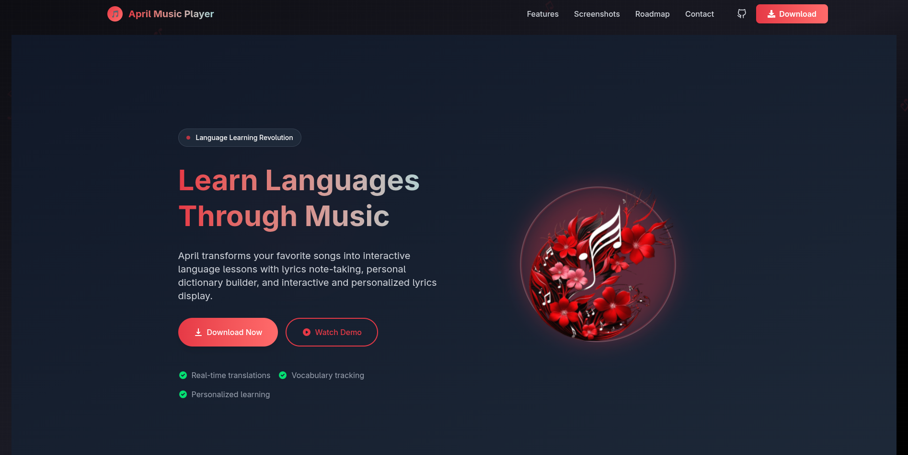

<h1 align="center">🌸 April Music Player — Landing Page</h1>

  A beautiful and responsive landing page for <strong>April Music Player</strong>, built to showcase the app with elegance and clarity.

  

  <a href="https://april-player.vercel.app/">🔗 Visit Live Site on Vercel</a>

---

## 🖼️ About This Repo

This repository contains the **landing page only** for [April Music Player](https://github.com/your-username/april-music-player), not the player app itself.

Built with:

- ⚛️ **React**
- 💨 **Tailwind CSS**
- 💻 **TypeScript**
- ▲ **Vercel Hosting**

---

## ✨ Highlights

- ⚡ Fully responsive design
- 🌙 Clean aesthetic for light and dark mode
- 🎯 Focused on showcasing features, previews, and branding
- 🔗 Direct link to download the desktop app
- 📷 Beautiful layout with image highlights

---
